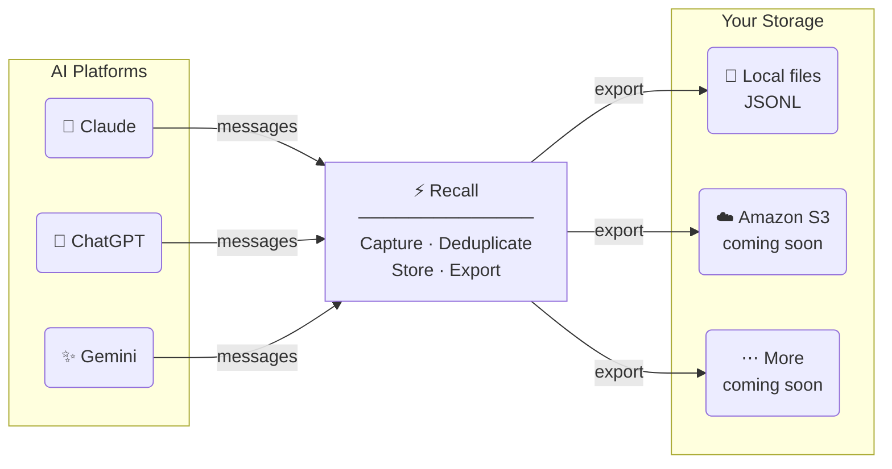

<h1 align="center">Recall</h1>

Your AI conversations shouldn't be trapped in one platform.

## The problem

Every AI platform — Claude, ChatGPT, Gemini — keeps your conversations siloed. Switch models and you start from scratch. The context you've built up: your preferences, your ongoing projects, the things you've already explained a dozen times — gone. You're constantly re-introducing yourself to every new model you try.

There's no portable memory layer. Your conversations belong to the platform, not to you.

## What Recall does

Recall is a Chrome extension that runs quietly in the background and captures your AI conversations locally as you have them. No accounts, no cloud sync, no third-party servers — everything stays on your machine.

Captured messages are exported as JSONL files, organized by platform and role. This gives you a clean, portable dataset of your AI interactions that you own and control.

The exported data is designed to feed into a retrieval layer (coming soon) — so you can carry your context with you when you switch models, or query your own conversation history to surface relevant past exchanges.



## Supported platforms

| Platform | Capture | Export |
|----------|---------|--------|
| Claude   | ✅       | ✅      |
| ChatGPT  | ✅       | ✅      |
| Gemini   | ✅       | ✅      |

## Features

- **Selective capture** — choose to capture your own messages, model responses, or both
- **Incremental export** — only new messages are exported each time, no duplicates
- **Auto export** — optionally export every night at 11:59 PM automatically
- **Local filesystem** — exports go to a folder you choose via the File System Access API
- **No backend** — everything runs in the extension, nothing leaves your machine

## Export format

Messages are exported as JSONL, one record per line, organized as:

```
{export-folder}/
  claude/
    claude_user_2026-03-17T23-59-00.jsonl
  chatgpt/
    chatgpt_user_2026-03-17T23-59-00.jsonl
    chatgpt_assistant_2026-03-17T23-59-00.jsonl
  gemini/
    gemini_user_2026-03-17T23-59-00.jsonl
```

Each record is self-contained:

```json
{
  "id": "uuid",
  "conversationId": "uuid",
  "platform": "chatgpt",
  "url": "https://chatgpt.com/c/...",
  "title": "Conversation title",
  "role": "user",
  "content": "The message text",
  "capturedAt": 1742256000000,
  "seq": 3
}
```

## Installation

Recall is not yet published to the Chrome Web Store. To install it locally:

1. Clone this repo
2. Run `npm install && npm run build`
3. Open `chrome://extensions` → enable **Developer mode**
4. Click **Load unpacked** → select the project root (not `dist/`)

## Roadmap

- [ ] Query/retrieval layer — semantic search over your captured history
- [ ] S3 export
- [ ] Chrome Web Store publication

## Why local-first?

Your conversation history is personal. It contains your thought process, your questions, your work. Sending it to another cloud service to enable portability trades one form of lock-in for another. Recall keeps the data on your machine so you decide what to do with it.
